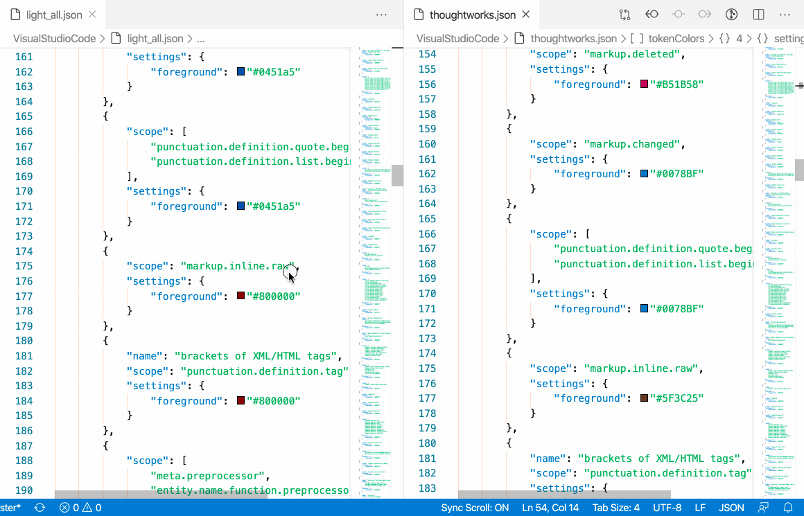
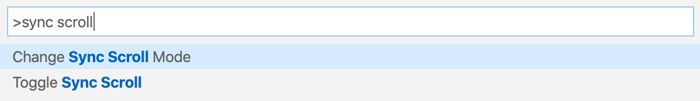

# Sync Scroll README

A Visual Studio Code Extension that make split panels scroll synchronically.

## Features

This extension support synchronizing scrolling between split panels. It will be auto turned on when there are split panels.

It also can be toggled by command `Toggle Sync Scroll`.

## Release Notes

### 1.0.0

Initial release of Sync Scroll with features:

* Can set all the split panels into scroll synchronized mode.

-----------------------------------------------------------------------------------------------------------

## How to Contribute

This extension is created by VSCode Extension Template (TypeScript) by [Yeoman](https://vscode.readthedocs.io/en/latest/extensions/yocode/).

Basically, you can work with this extension source code as a normal typescript project.
