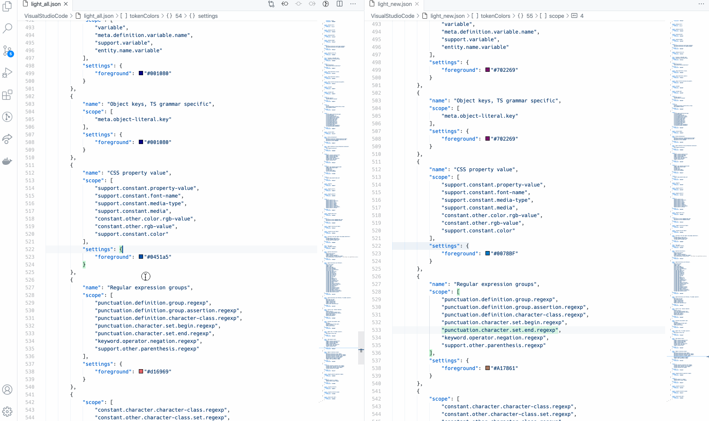
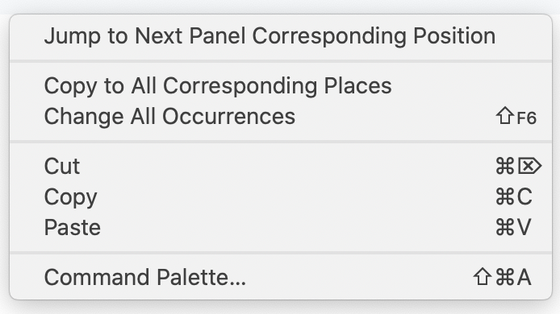

# Sync Scroll README

A Visual Studio Code Extension that make split panels scroll synchronically.

## Features

This extension support synchronizing scrolling between split panels. You can choose your sync mode to make them scrolled together.

There're also commands you can use conveniently.

Also it will automatically highlight the corresponding selections when you focus the cursor on the one side.

Here are two commands you can find in the right-click menu in the content window.

- `Jump to Next Panel Corresponding Position` for navigating around the panels and in the corresponding position. It's very convenient to quick focus on the other side.
- `Copy to All Corresponding Places` for replacing all the text at corresponding positions from the selections. For example, it's for the case that you want to use the selected text on the left side also on the right side.

## Release Notes

### 1.3.0

Add features:

- Add command to jump to corresponding position in the next panel
- Add command to copy selections to all corresponding positions.

Enhancement:

- Fix the issue of the output panel which shouldn't be involved in the scrolling sync.

### 1.2.0

Add features:

- Add corresponding line highlight feature.

Enhancement:

- Fix back and forth scroll issue in diff(selecting file to compare)/scm(viewing file changes) case.

### 1.1.1

Enhancement:

- Persist the toggle state and mode
- Fix back and forth scroll issue in diff(selecting file to compare)/scm(viewing file changes) case.

### 1.1.0

Add features:

- Now you can choose a sync mode when it turns on:
  - NORMAL - aligned by the top of the view range.
  - OFFSET - aligned by the scrolled lines offset.

Enhancement:

- Get rid of the scrolling delay.
- Fix the issue that cannot toggle on/off when not focus on any editor.
  
### 1.0.0

Initial release of Sync Scroll with features:

* Can set all the split panels into scroll synchronized mode.

-----------------------------------------------------------------------------------------------------------

## How to Contribute

This extension is created by VSCode Extension Template (TypeScript) by [Yeoman](https://vscode.readthedocs.io/en/latest/extensions/yocode/).

Basically, you can work with this extension source code as a normal typescript project.
